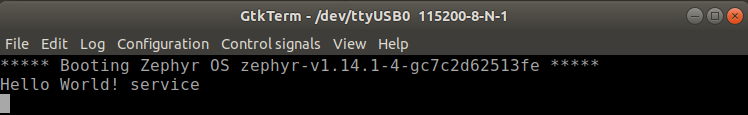

# MAX1000

READMEには書かれていないが、`CYC1000`で実行するためのファイルが追加されており、それを参考にMAX1000用を実装した。ただし、Cyclone10とMAX10では使用できるPLL IP等が違うのでファイルの流用だけでは終わらなかった。

## 追加ファイル

|ファイル  | 説明          | 追加/変更 |
|:---------|:--------------|:---------:|
|`data/max1000.sdc` | SDCファイル | 追加 |
|`data/max1000.tcl` | PIN設定 | 追加 |
|`servant/servmax1000.v` | topファイル | 追加 |
|`servant/max1000_pll.v` | PLLファイル(12MHz->32MHz) | 追加 |
|`servant.core` | max1000用の定義を追加 | 変更 |

## 注意点

- MAX10では、初期化ファイルを設定する場合、オプション`INTERNAL_FLASH_UPDATE_MODE`を`SINGLE IMAGE WITH ERAM`を設定する必要がある
- 実行前に`intelFPGA_lite/18.1/nios2eds/nios2_command_shell.sh`を実行してQuartus CLIにパスを通しておく
- UARTはクロック32MHzで115200bpsになるよう設定されている。

## Hello World実行結果

